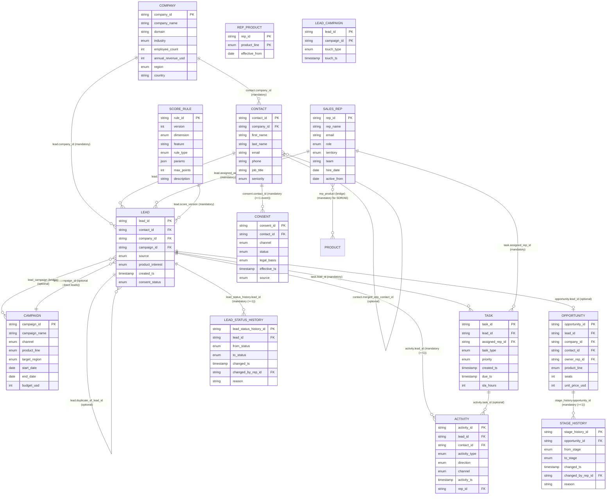

# Entity-relationship diagram

```mermaid
erDiagram
  COMPANY ||--o{ CONTACT : "contact.company_id (mandatory)"
  COMPANY ||--o{ LEAD : "lead.company_id (mandatory)"
  CONTACT ||--o{ LEAD : "lead.contact_id (mandatory)"
  CONTACT ||--o{ CONSENT : "consent.contact_id (mandatory (>=1 event))"
  CONTACT ||--o{ CONTACT : "contact.merged_into_contact_id (optional)"
  CAMPAIGN ||--o{ LEAD : "lead.campaign_id (optional (direct leads))"
  LEAD }o--o{ CAMPAIGN : "lead_campaign (bridge) (optional)"
  SALES_REP }o--o{ PRODUCT : "rep_product (bridge) (mandatory for SDR/AE)"
  SALES_REP ||--o{ LEAD : "lead.assigned_rep_id (mandatory)"
  LEAD ||--o{ LEAD : "lead.duplicate_of_lead_id (optional)"
  LEAD ||--o{ ACTIVITY : "activity.lead_id (mandatory (>=1))"
  LEAD ||--o{ TASK : "task.lead_id (mandatory)"
  SALES_REP ||--o{ TASK : "task.assigned_rep_id (mandatory)"
  TASK ||--o{ ACTIVITY : "activity.task_id (optional)"
  LEAD ||--o| OPPORTUNITY : "opportunity.lead_id (optional)"
  OPPORTUNITY ||--o{ STAGE_HISTORY : "stage_history.opportunity_id (mandatory (>=1))"
  LEAD ||--o{ LEAD_STATUS_HISTORY : "lead_status_history.lead_id (mandatory (>=1))"
  SCORE_RULE ||--o{ LEAD : "lead.score_version (mandatory)"
  COMPANY {
    string company_id PK
    string company_name
    string domain
    enum industry
    int employee_count
    int annual_revenue_usd
    enum region
    string country
  }
  CONTACT {
    string contact_id PK
    string company_id FK
    string first_name
    string last_name
    string email
    string phone
    string job_title
    enum seniority
  }
  CAMPAIGN {
    string campaign_id PK
    string campaign_name
    enum channel
    enum product_line
    enum target_region
    date start_date
    date end_date
    int budget_usd
  }
  SALES_REP {
    string rep_id PK
    string rep_name
    string email
    enum role
    enum territory
    string team
    date hire_date
    date active_from
  }
  REP_PRODUCT {
    string rep_id PK
    enum product_line PK
    date effective_from
  }
  LEAD {
    string lead_id PK
    string contact_id FK
    string company_id FK
    string campaign_id FK
    enum source
    enum product_interest
    timestamp created_ts
    enum consent_status
  }
  LEAD_CAMPAIGN {
    string lead_id PK
    string campaign_id PK
    enum touch_type
    timestamp touch_ts
  }
  CONSENT {
    string consent_id PK
    string contact_id FK
    enum channel
    enum status
    enum legal_basis
    timestamp effective_ts
    enum source
  }
  SCORE_RULE {
    string rule_id PK
    int version
    enum dimension
    string feature
    enum rule_type
    json params
    int max_points
    string description
  }
  ACTIVITY {
    string activity_id PK
    string lead_id FK
    string contact_id FK
    enum activity_type
    enum direction
    enum channel
    timestamp activity_ts
    string rep_id FK
  }
  TASK {
    string task_id PK
    string lead_id FK
    string assigned_rep_id FK
    enum task_type
    enum priority
    timestamp created_ts
    timestamp due_ts
    int sla_hours
  }
  OPPORTUNITY {
    string opportunity_id PK
    string lead_id FK
    string company_id FK
    string contact_id FK
    string owner_rep_id FK
    enum product_line
    int seats
    int unit_price_usd
  }
  STAGE_HISTORY {
    string stage_history_id PK
    string opportunity_id FK
    enum from_stage
    enum to_stage
    timestamp changed_ts
    string changed_by_rep_id FK
    string reason
  }
  LEAD_STATUS_HISTORY {
    string lead_status_history_id PK
    string lead_id FK
    enum from_status
    enum to_status
    timestamp changed_ts
    string changed_by_rep_id FK
    string reason
  }
```
